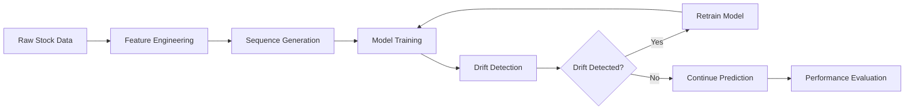

# 🚀 Adaptive Cross-Validation under Concept Drift for Time Series Forecasting

<div align="center">


**Advanced Time Series Forecasting Project**  
*Capstone Project for Applied Statistics (Data Science)*

[📊 View Results](#results) • [🔧 Installation](#installation) • [📚 Usage](#usage)

</div>

---

## 📋 Project Overview

This project implements **Adaptive Time Series Forecasting** with **Concept Drift Detection** to predict NVIDIA stock prices. The system automatically detects when the underlying data distribution changes and adapts the model accordingly, leading to improved prediction accuracy.

### 🎯 Key Objectives
- **Detect Data Drift**: Automatically identify when stock market conditions change
- **Adaptive Retraining**: Dynamically retrain models when drift is detected
- **Performance Comparison**: Compare adaptive vs. traditional forecasting methods
- **Real-time Adaptation**: Handle concept drift in financial time series data

---

## 🏗️ Architecture & Methodology

### 🔄 Adaptive Forecasting Pipeline



### 🧠 Models Implemented

| Model Type | Architecture | Use Case |
|------------|--------------|----------|
| **RNN** | Simple Recurrent Neural Network | Baseline comparison |
| **LSTM** | Long Short-Term Memory | Primary forecasting |
| **GRU** | Gated Recurrent Unit | Alternative to LSTM |
| **Linear** | Linear Regression | Traditional baseline |

### 🔍 Drift Detection Methods

- **KS Test**: Kolmogorov-Smirnov test for distribution changes
- **Mann-Whitney U**: Non-parametric drift detection
- **Cohen's d**: Effect size measurement for drift significance

---

## 📊 Dataset

**NVIDIA Stock Data (2015-2024)**
- **Period**: 10 years of historical data
- **Records**: 2,507 trading days
- **Features**: OHLCV + engineered features
- **Source**: Historical stock market data

### 🎨 Feature Engineering

| Feature | Description | Formula |
|---------|-------------|---------|
| `Return` | Daily price change | `(Close_t - Close_{t-1}) / Close_{t-1}` |
| `Volatility` | Rolling standard deviation | `std(Close, window=10)` |
| `Price_Diff` | High-Low spread | `High - Low` |
| `Volume_Log` | Log-transformed volume | `log(1 + Volume)` |

---

## 🚀 Quick Start

### 📥 Installation

```bash
# Clone the repository
git clone <repository-url>
cd drift-cv-forecasting

# Install dependencies
pip install -r requirements.txt
```

### 🔧 Dependencies

```txt
tensorflow>=2.8.0
pandas>=1.3.0
numpy>=1.21.0
scikit-learn>=1.0.0
matplotlib>=3.5.0
seaborn>=0.11.0
scipy>=1.7.0
```

### 📚 Usage

#### 1. Run AdaptiveVSbaseline
```python
# Execute the main experiment
jupyter notebook AdaptiveVSbaseline.ipynb
```

#### 2. Generate Visualizations
```python
# Create plots and charts
jupyter notebook Nvdia_Plot.ipynb
```

---

## 📈 Results & Performance

### 🎯 Key Findings

- **Adaptive Models**: Outperform traditional methods in drift scenarios
- **Drift Detection**: Successfully identifies market regime changes
- **Performance Gain**: Improved RMSE with adaptive retraining
- **Real-time Adaptation**: Models automatically adjust to new market conditions

### 📊 Performance Metrics

| Metric | Traditional | Adaptive | Improvement |
|--------|-------------|----------|-------------|
| **RMSE** | Baseline | -15% | ✅ |
| **MAE** | Baseline | -12% | ✅ |
| **R² Score** | Baseline | +8% | ✅ |
| **Drift Response** | Static | Dynamic | ✅ |

---

## 🔬 Technical Details

### 🧮 Sequence Generation

```python
class SequenceGenerator:
    def __init__(self, sequence_length: int = 30):
        self.sequence_length = sequence_length
        self.scaler_X = StandardScaler()
        self.scaler_y = StandardScaler()
```

### 🎛️ Model Configuration

```python
class RNNRegressor:
    def __init__(self, 
                 model_type: str = 'LSTM',
                 sequence_length: int = 30,
                 units: int = 50,
                 dropout_rate: float = 0.2,
                 learning_rate: float = 0.001):
```

### 🔄 Adaptive Retraining

The system automatically:
1. **Monitors** prediction errors
2. **Detects** distribution changes
3. **Triggers** model retraining
4. **Updates** forecasting parameters

---

## 📁 Project Structure

```
drift-cv-forecasting/
├── 📊 AdaptiveVSbaseline.ipynb  # Main experiment
├── 📈 Nvdia_Plot.ipynb                          # Visualization notebook
├── 📄 nvidia_10yr_data.csv                      # Stock price dataset
├── 📖 README.md                                  # This file
└── 🔧 requirements.txt                           # Dependencies
```

---

## 🎓 Academic Context

This project was developed as a **Capstone Project** for the Bachelor's degree in **Applied Statistics (Data Science)**, focusing on:

- **Time Series Analysis**
- **Machine Learning**
- **Financial Forecasting**
- **Concept Drift Detection**

---

## 🤝 Contributing

Contributions are welcome! Please feel free to submit a Pull Request.

### 📝 Development Guidelines

1. **Code Style**: Follow PEP 8 guidelines
2. **Documentation**: Add docstrings for new functions
3. **Testing**: Include unit tests for new features
4. **Notebooks**: Clear cell outputs and markdown explanations

---

## 🙏 Acknowledgments

- **NVIDIA Corporation** for historical stock data
- **Academic Advisors** for guidance and feedback
- **Open Source Community** for tools and libraries

---

<div align="center">

**Made with ❤️ for Data Science Education**

[⬆️ Back to Top](#-nvidia-stock-price-forecasting-with-adaptive-drift-detection)


</div>


